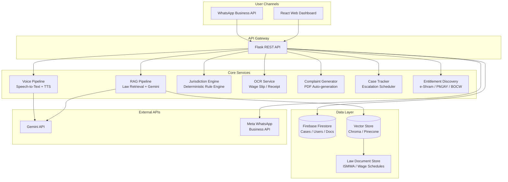
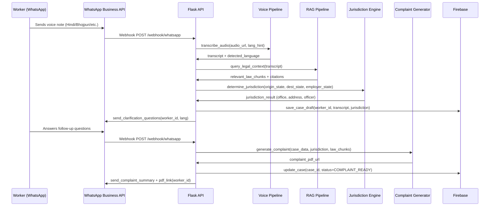
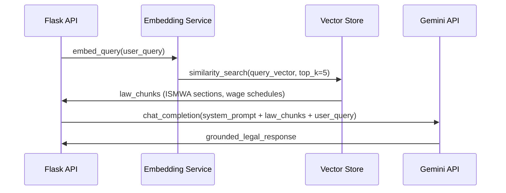
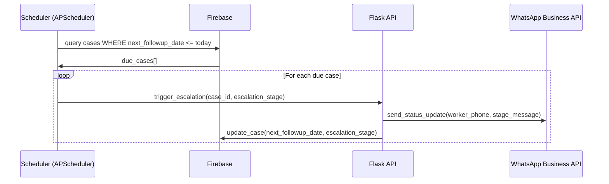

# Design Document: NyaySetu AI

## Overview

NyaySetu AI is a WhatsApp-native, voice-first legal aid platform for India's migrant workers. It enables workers to report wage theft, determine the correct legal jurisdiction under the Inter-State Migrant Workmen Act 1979 (ISMWA), auto-generate formal complaints, and track cases to resolution — entirely through WhatsApp voice/text messages in 10+ regional languages.

The system is built on three pillars: (1) a voice-first multilingual intake pipeline powered by Gemini API, (2) a RAG pipeline grounding Gemini's reasoning in actual statutory text (ISMWA 1979, state minimum wage schedules, BOCW rules), and (3) a deterministic jurisdiction engine that maps worker origin/destination state pairs to the correct Labour Commissioner office without relying on LLM inference.

A React + Tailwind web dashboard serves NGOs and case managers, while the primary user-facing channel is WhatsApp Business API — no app install required.

## Architecture



## Sequence Diagrams

### Main Flow: Voice Complaint Intake via WhatsApp



### RAG Pipeline: Law Retrieval



### Case Escalation Flow




## Components and Interfaces

### Component 1: WhatsApp Webhook Handler

**Purpose**: Receives inbound messages (voice notes, text, images) from Meta's WhatsApp Business API and routes them to the appropriate service.

**Interface**:
```python
@app.route('/webhook/whatsapp', methods=['POST'])
def whatsapp_webhook() -> Response:
    """
    Receives WhatsApp webhook events.
    Validates x-hub-signature-256 header.
    Routes: audio -> VoicePipeline, text -> RAGPipeline, image -> OCRService
    """

class WhatsAppClient:
    def send_text(self, to: str, body: str) -> dict: ...
    def send_document(self, to: str, doc_url: str, caption: str) -> dict: ...
    def send_interactive_buttons(self, to: str, body: str, buttons: list[dict]) -> dict: ...
    def download_media(self, media_id: str) -> bytes: ...
```

**Responsibilities**:
- Validate webhook signature (HMAC-SHA256)
- Parse message type (text / audio / image / interactive reply)
- Maintain conversation state per phone number in Firebase
- Send outbound messages (text, PDF links, interactive buttons)

---

### Component 2: Voice Pipeline

**Purpose**: Converts incoming audio (OGG/Opus from WhatsApp) to text, detects language, and synthesises TTS responses.

**Interface**:
```python
class VoicePipeline:
    def transcribe(self, audio_bytes: bytes, lang_hint: str | None = None) -> TranscriptResult: ...
    def synthesize(self, text: str, lang: str) -> bytes: ...  # returns MP3 bytes

@dataclass
class TranscriptResult:
    text: str
    detected_language: str   # BCP-47 code e.g. "hi", "bho", "or"
    confidence: float
```

**Responsibilities**:
- Convert OGG/Opus → WAV before sending to Gemini STT
- Detect language from first utterance; persist to session
- Synthesize TTS for follow-up questions in worker's language
- Supported languages: hi, bho, mai, or, bn, sat, ta, gu, mr, pa

---

### Component 3: RAG Pipeline

**Purpose**: Retrieves relevant statutory text from the vector store and constructs grounded prompts for Gemini.

**Interface**:
```python
class RAGPipeline:
    def ingest_documents(self, docs: list[LawDocument]) -> None: ...
    def query(self, user_query: str, top_k: int = 5) -> RAGResult: ...

@dataclass
class LawDocument:
    doc_id: str
    title: str          # e.g. "ISMWA 1979 Section 13"
    content: str
    metadata: dict      # state, act_name, section_number, effective_date

@dataclass
class RAGResult:
    answer: str
    source_chunks: list[LawChunk]
    citations: list[str]
```

**Responsibilities**:
- Embed law documents (ISMWA 1979, state minimum wage schedules, BOCW rules) at startup
- Perform cosine similarity search against query embedding
- Build system prompt: `[LEGAL CONTEXT]\n{chunks}\n[QUESTION]\n{query}`
- Return Gemini's answer with source citations

---

### Component 4: Jurisdiction Engine

**Purpose**: Deterministically maps (origin_state, destination_state, employer_registration_state) to the correct Labour Commissioner office under ISMWA 1979.

**Interface**:
```python
class JurisdictionEngine:
    def determine(self, origin_state: str, dest_state: str, employer_state: str) -> JurisdictionResult: ...

@dataclass
class JurisdictionResult:
    primary_office: LabourOffice
    alternate_offices: list[LabourOffice]
    applicable_act: str
    filing_state: str
    rationale: str          # human-readable explanation

@dataclass
class LabourOffice:
    state: str
    office_name: str
    address: str
    officer_designation: str
    contact_email: str
    contact_phone: str
```

**Responsibilities**:
- Rule: ISMWA 1979 §13 — complaint filed in destination state OR origin state at worker's choice
- Rule: If employer registered in a third state, that state's office is also valid
- Load office directory from Firebase on startup; refresh daily
- Never delegate jurisdiction logic to LLM

---

### Component 5: OCR Service

**Purpose**: Extracts structured wage data from photos of wage slips, receipts, and employment cards.

**Interface**:
```python
class OCRService:
    def extract_wage_data(self, image_bytes: bytes) -> WageData: ...

@dataclass
class WageData:
    employer_name: str | None
    worker_name: str | None
    period_start: date | None
    period_end: date | None
    wages_paid: float | None
    wages_due: float | None
    deductions: dict[str, float]
    raw_text: str
    confidence: float
```

**Responsibilities**:
- Accept JPEG/PNG/HEIC from WhatsApp image messages
- Use Gemini Vision for structured extraction
- Return structured WageData; low-confidence fields flagged for manual confirmation
- Store original image in Firebase Storage

---

### Component 6: Complaint Generator

**Purpose**: Produces a legally formatted PDF complaint under ISMWA 1979 ready for submission to the Labour Commissioner.

**Interface**:
```python
class ComplaintGenerator:
    def generate(self, case: Case, jurisdiction: JurisdictionResult) -> ComplaintDocument: ...

@dataclass
class ComplaintDocument:
    pdf_bytes: bytes
    storage_url: str
    complaint_number: str   # NyaySetu internal reference
    sections: list[str]     # section numbers cited
```

**Responsibilities**:
- Populate Jinja2 HTML template with case data
- Render to PDF via WeasyPrint
- Include: worker details, employer details, wage calculation, ISMWA sections violated, relief sought, jurisdiction statement
- Upload to Firebase Storage; return public URL

---

### Component 7: Case Tracker & Escalation Scheduler

**Purpose**: Tracks case lifecycle and triggers time-based escalations via WhatsApp notifications.

**Interface**:
```python
class CaseTracker:
    def create_case(self, worker_id: str, intake_data: IntakeData) -> Case: ...
    def update_status(self, case_id: str, status: CaseStatus, notes: str = "") -> None: ...
    def get_due_escalations(self) -> list[EscalationTask]: ...

class EscalationStatus(Enum):
    DAY_7_FOLLOWUP = "day_7_followup"
    DAY_14_FOLLOWUP = "day_14_followup"
    DAY_30_LABOUR_COURT = "day_30_labour_court"
    DAY_45_RTI = "day_45_rti"
```

**Responsibilities**:
- Schedule escalation dates at case creation (Day 7, 14, 30, 45)
- APScheduler job runs every 6 hours; queries Firebase for due escalations
- Day 30: generate Labour Court petition PDF
- Day 45: generate RTI application PDF
- Send WhatsApp status updates in worker's language


## Data Models

### Model: Case

```python
@dataclass
class Case:
    case_id: str                        # UUID
    worker_id: str                      # Firebase UID
    status: CaseStatus                  # INTAKE | COMPLAINT_READY | FILED | ESCALATED | RESOLVED
    created_at: datetime
    updated_at: datetime

    # Worker details
    worker_name: str
    worker_phone: str                   # E.164 format
    worker_language: str                # BCP-47
    origin_state: str
    destination_state: str

    # Employer details
    employer_name: str
    employer_address: str
    employer_registration_state: str | None

    # Wage claim
    wage_data: WageData
    wages_owed: float
    period_start: date
    period_end: date

    # Legal
    jurisdiction: JurisdictionResult
    applicable_sections: list[str]      # ISMWA section numbers
    complaint_url: str | None           # Firebase Storage URL

    # Escalation
    escalation_stage: EscalationStatus | None
    next_followup_date: date | None
    escalation_history: list[EscalationEvent]

    # Group complaint
    group_id: str | None                # links to GroupComplaint if applicable
    is_lead_complainant: bool
```

### Model: Worker

```python
@dataclass
class Worker:
    worker_id: str
    phone: str                          # E.164
    name: str
    preferred_language: str             # BCP-47
    origin_state: str
    destination_state: str
    aadhaar_last4: str | None
    eshram_card: str | None
    bocw_registered: bool
    pmjay_eligible: bool | None
    cases: list[str]                    # case_id references
    created_at: datetime
```

### Model: GroupComplaint

```python
@dataclass
class GroupComplaint:
    group_id: str
    lead_case_id: str
    member_case_ids: list[str]          # max 50
    ngo_id: str | None
    employer_name: str
    employer_address: str
    total_wages_owed: float
    combined_complaint_url: str | None
    created_at: datetime
```

### Model: ConversationSession

```python
@dataclass
class ConversationSession:
    session_id: str
    worker_phone: str
    state: ConversationState            # GREETING | INTAKE | CLARIFICATION | REVIEW | COMPLETE
    language: str
    collected_fields: dict[str, Any]    # partial intake data
    pending_questions: list[str]
    last_activity: datetime
    expires_at: datetime                # TTL: 24 hours of inactivity
```

**Validation Rules**:
- `worker_phone` must match E.164 regex `^\+[1-9]\d{1,14}$`
- `wages_owed` must be > 0
- `origin_state` and `destination_state` must be valid Indian state codes
- `member_case_ids` length ≤ 50 for GroupComplaint
- `ConversationSession` expires after 24h inactivity; resumed with context summary

---

## Algorithmic Pseudocode

### Main Intake Algorithm

```pascal
ALGORITHM process_whatsapp_message(webhook_payload)
INPUT: webhook_payload from Meta WhatsApp API
OUTPUT: response sent back to worker via WhatsApp

BEGIN
  ASSERT validate_signature(webhook_payload.headers) = true

  message ← extract_message(webhook_payload)
  session ← get_or_create_session(message.from_phone)

  IF message.type = AUDIO THEN
    transcript ← VoicePipeline.transcribe(message.audio_bytes, session.language)
    session.language ← transcript.detected_language
    user_text ← transcript.text
  ELSE IF message.type = IMAGE THEN
    wage_data ← OCRService.extract_wage_data(message.image_bytes)
    session.collected_fields["wage_data"] ← wage_data
    user_text ← "Image processed"
  ELSE
    user_text ← message.text
  END IF

  law_context ← RAGPipeline.query(user_text)

  CASE session.state OF
    GREETING:
      response ← generate_greeting(session.language)
      session.state ← INTAKE
    INTAKE:
      fields ← extract_intake_fields(user_text, law_context, session.collected_fields)
      session.collected_fields ← merge(session.collected_fields, fields)
      missing ← get_missing_required_fields(session.collected_fields)
      IF missing IS EMPTY THEN
        session.state ← CLARIFICATION
        response ← generate_clarification_questions(session.collected_fields, session.language)
      ELSE
        response ← ask_next_field(missing[0], session.language)
      END IF
    CLARIFICATION:
      session.collected_fields ← update_with_clarification(user_text, session.collected_fields)
      IF all_clarifications_complete(session.collected_fields) THEN
        jurisdiction ← JurisdictionEngine.determine(
          session.collected_fields.origin_state,
          session.collected_fields.dest_state,
          session.collected_fields.employer_state
        )
        case ← CaseTracker.create_case(session.worker_id, session.collected_fields, jurisdiction)
        complaint ← ComplaintGenerator.generate(case, jurisdiction)
        session.state ← REVIEW
        response ← format_complaint_summary(complaint, jurisdiction, session.language)
      ELSE
        response ← ask_next_clarification(session.collected_fields, session.language)
      END IF
    REVIEW:
      IF user_confirms(user_text) THEN
        CaseTracker.update_status(case.case_id, COMPLAINT_READY)
        session.state ← COMPLETE
        response ← send_complaint_pdf_link(complaint.storage_url, session.language)
      ELSE
        session.state ← INTAKE
        response ← ask_what_to_change(session.language)
      END IF
  END CASE

  save_session(session)
  WhatsAppClient.send(message.from_phone, response)
END
```

**Preconditions**:
- `webhook_payload` has valid HMAC-SHA256 signature
- Firebase session store is reachable
- Gemini API key is configured

**Postconditions**:
- Worker receives a response in their detected language
- Session state advances or remains at current state pending more input
- All collected data persisted to Firebase before response is sent

**Loop Invariants** (field collection loop):
- `session.collected_fields` only grows; fields are never removed once set
- `missing` list strictly decreases with each valid user response

---

### Jurisdiction Determination Algorithm

```pascal
ALGORITHM determine_jurisdiction(origin_state, dest_state, employer_state)
INPUT: origin_state: str, dest_state: str, employer_state: str
OUTPUT: JurisdictionResult

BEGIN
  ASSERT origin_state IN VALID_INDIAN_STATES
  ASSERT dest_state IN VALID_INDIAN_STATES

  valid_offices ← []

  // ISMWA 1979 §13: worker may file in destination OR origin state
  dest_office ← lookup_labour_office(dest_state)
  origin_office ← lookup_labour_office(origin_state)

  IF dest_office IS NOT NULL THEN
    valid_offices.append(dest_office)
  END IF

  IF origin_office IS NOT NULL AND origin_office != dest_office THEN
    valid_offices.append(origin_office)
  END IF

  // If employer registered in a third state, that office is also valid
  IF employer_state IS NOT NULL AND employer_state NOT IN [origin_state, dest_state] THEN
    employer_office ← lookup_labour_office(employer_state)
    IF employer_office IS NOT NULL THEN
      valid_offices.append(employer_office)
    END IF
  END IF

  ASSERT valid_offices IS NOT EMPTY

  primary ← valid_offices[0]   // destination state preferred per ISMWA §13
  alternates ← valid_offices[1:]

  RETURN JurisdictionResult(
    primary_office = primary,
    alternate_offices = alternates,
    applicable_act = "Inter-State Migrant Workmen Act 1979",
    filing_state = primary.state,
    rationale = build_rationale(origin_state, dest_state, employer_state)
  )
END
```

**Preconditions**:
- `origin_state` and `dest_state` are valid ISO 3166-2:IN state codes
- Labour office directory is loaded and non-empty

**Postconditions**:
- `primary_office` is always the destination state office (ISMWA §13 preference)
- `valid_offices` contains at least one entry
- No LLM call is made; result is fully deterministic

---

### RAG Query Algorithm

```pascal
ALGORITHM rag_query(user_query, top_k=5)
INPUT: user_query: str, top_k: int
OUTPUT: RAGResult

BEGIN
  ASSERT user_query IS NOT EMPTY
  ASSERT top_k > 0

  query_embedding ← embed(user_query)   // Gemini text-embedding-004

  chunks ← vector_store.similarity_search(query_embedding, top_k)

  ASSERT chunks IS NOT EMPTY

  system_prompt ← build_system_prompt(chunks)
  // system_prompt = "You are a legal aid assistant for Indian migrant workers.
  //   Answer ONLY based on the following legal context. Cite section numbers.
  //   [LEGAL CONTEXT]\n{chunk_texts}\n[END CONTEXT]"

  response ← GeminiAPI.generate_content(
    model = "gemini-1.5-pro",
    system_instruction = system_prompt,
    user_message = user_query,
    temperature = 0.1   // low temperature for legal accuracy
  )

  citations ← extract_citations(response.text, chunks)

  RETURN RAGResult(
    answer = response.text,
    source_chunks = chunks,
    citations = citations
  )
END
```

**Preconditions**:
- Vector store is populated with ingested law documents
- Gemini API is reachable and API key is valid

**Postconditions**:
- Answer is grounded in retrieved chunks only (not Gemini's parametric knowledge)
- Citations reference actual ISMWA sections or wage schedule entries
- Temperature = 0.1 ensures deterministic, conservative legal answers


## Key Functions with Formal Specifications

### `VoicePipeline.transcribe(audio_bytes, lang_hint)`

```python
def transcribe(self, audio_bytes: bytes, lang_hint: str | None = None) -> TranscriptResult:
```

**Preconditions**:
- `audio_bytes` is non-empty, valid OGG/Opus or WAV audio
- `lang_hint` is a valid BCP-47 code or None

**Postconditions**:
- `result.text` is non-empty string
- `result.detected_language` is a BCP-47 code in the supported set
- `result.confidence` ∈ [0.0, 1.0]
- If `lang_hint` is provided and confidence < 0.6, re-attempt with `lang_hint`

---

### `JurisdictionEngine.determine(origin_state, dest_state, employer_state)`

```python
def determine(self, origin_state: str, dest_state: str, employer_state: str) -> JurisdictionResult:
```

**Preconditions**:
- `origin_state` ∈ VALID_INDIAN_STATES (28 states + 8 UTs)
- `dest_state` ∈ VALID_INDIAN_STATES
- `employer_state` ∈ VALID_INDIAN_STATES ∪ {None}

**Postconditions**:
- `result.primary_office.state == dest_state` (ISMWA §13 preference)
- `len(result.valid_offices) >= 1`
- No external API call is made; result derived from static rule table
- `result.applicable_act == "Inter-State Migrant Workmen Act 1979"`

---

### `RAGPipeline.query(user_query, top_k)`

```python
def query(self, user_query: str, top_k: int = 5) -> RAGResult:
```

**Preconditions**:
- `user_query` is non-empty, max 2000 characters
- `top_k` ∈ [1, 20]
- Vector store contains at least `top_k` documents

**Postconditions**:
- `result.answer` is non-empty
- `len(result.source_chunks) <= top_k`
- All citations in `result.citations` reference documents present in `result.source_chunks`
- Gemini temperature = 0.1 (enforced in implementation)

---

### `ComplaintGenerator.generate(case, jurisdiction)`

```python
def generate(self, case: Case, jurisdiction: JurisdictionResult) -> ComplaintDocument:
```

**Preconditions**:
- `case.worker_name` is non-empty
- `case.wages_owed > 0`
- `case.period_start < case.period_end`
- `jurisdiction.primary_office` is not None

**Postconditions**:
- `result.pdf_bytes` is a valid PDF (starts with `%PDF-`)
- `result.storage_url` is a publicly accessible Firebase Storage URL
- `result.complaint_number` is unique (UUID-based)
- PDF contains worker name, employer name, wages owed, ISMWA sections, and jurisdiction statement

---

### `CaseTracker.get_due_escalations()`

```python
def get_due_escalations(self) -> list[EscalationTask]:
```

**Preconditions**:
- Firebase Firestore is reachable
- Current UTC date is available

**Postconditions**:
- Returns only cases where `next_followup_date <= today` AND `status != RESOLVED`
- Each returned task has a valid `escalation_stage`
- No case appears twice in the result list

---

## Example Usage

### Worker Sends Voice Note via WhatsApp

```python
# Incoming webhook from Meta
payload = {
    "entry": [{
        "changes": [{
            "value": {
                "messages": [{
                    "from": "+919876543210",
                    "type": "audio",
                    "audio": {"id": "media_id_123"}
                }]
            }
        }]
    }]
}

# Flask route processes it
response = app.test_client().post('/webhook/whatsapp', json=payload,
    headers={"x-hub-signature-256": compute_sig(payload)})

# Worker receives transcription confirmation + first intake question in Hindi
```

### Jurisdiction Determination

```python
engine = JurisdictionEngine()
result = engine.determine(
    origin_state="BR",      # Bihar
    dest_state="MH",        # Maharashtra
    employer_state="MH"
)
# result.primary_office.state == "MH"
# result.primary_office.office_name == "Office of the Labour Commissioner, Maharashtra"
# result.applicable_act == "Inter-State Migrant Workmen Act 1979"
# result.rationale == "Under ISMWA 1979 §13, complaint may be filed in Maharashtra
#                      (destination state) or Bihar (origin state). Maharashtra preferred."
```

### RAG Query for Legal Grounding

```python
rag = RAGPipeline(vector_store=chroma_client, gemini_client=gemini)
result = rag.query("What is the minimum wage for construction workers in Maharashtra?")
# result.answer: "Under the Maharashtra Minimum Wages Schedule (2024), construction
#                 workers are entitled to ₹X/day. [Source: MH Wage Schedule §3, Table B]"
# result.citations: ["Maharashtra Minimum Wages Schedule 2024 §3 Table B"]
```

### Group Complaint Creation (NGO Dashboard)

```python
# React frontend POST to Flask API
POST /api/group-complaints
{
  "lead_case_id": "case_abc123",
  "member_case_ids": ["case_def456", "case_ghi789"],  # up to 50
  "ngo_id": "ngo_xyz"
}
# Returns combined complaint PDF covering all workers
```

---

## Correctness Properties

*A property is a characteristic or behavior that should hold true across all valid executions of a system — essentially, a formal statement about what the system should do. Properties serve as the bridge between human-readable specifications and machine-verifiable correctness guarantees.*

### Property 1: Jurisdiction Determinism

*For any* valid (origin_state, dest_state, employer_state) triple, calling `JurisdictionEngine.determine()` twice with identical inputs must return identical results.

**Validates: Requirements 4.1, 4.6**

### Property 2: Jurisdiction Primary Office is Destination State

*For any* valid (origin_state, dest_state, employer_state) triple, `result.primary_office.state` must equal `dest_state`, in accordance with ISMWA 1979 §13.

**Validates: Requirements 4.2**

### Property 3: Jurisdiction Engine Makes No External API Calls

*For any* valid input triple, `JurisdictionEngine.determine()` must complete without making any call to an external API (verified by mocking all HTTP clients and asserting zero invocations).

**Validates: Requirements 4.1**

### Property 4: RAG Citations Are Grounded in Retrieved Chunks

*For any* user query, every citation string in `RAGResult.citations` must reference a `doc_id` present in `RAGResult.source_chunks`.

**Validates: Requirements 3.5**

### Property 5: Law Document Ingestion Round-Trip

*For any* valid `LawDocument`, parsing it, pretty-printing it, then parsing the result again must produce an object equivalent to the original.

**Validates: Requirements 14.4**

### Property 6: Complaint PDF Validity

*For any* valid `Case` and `JurisdictionResult`, the generated `ComplaintDocument.pdf_bytes` must begin with the magic bytes `%PDF-`, have a non-None `complaint_number`, and contain at least one ISMWA section in `sections`.

**Validates: Requirements 6.1, 6.3, 6.5**

### Property 7: Escalation History is Monotonically Increasing

*For any* case, the `triggered_at` timestamps in `case.escalation_history` must be in strictly ascending order.

**Validates: Requirements 8.7**

### Property 8: Group Complaint Size Constraint

*For any* `GroupComplaint`, `len(member_case_ids)` must be less than or equal to 50.

**Validates: Requirements 9.2**

### Property 9: Session Language Persists Once Detected

*For any* ConversationSession where `detected_language` was set with `confidence >= 0.6`, the session language must not change for the remainder of that session.

**Validates: Requirements 2.4**

### Property 10: Collected Fields Are Monotonically Growing

*For any* ConversationSession, the set of keys in `collected_fields` must only grow over the lifetime of the session; no key that was set may be removed.

**Validates: Requirements 7.8**

### Property 11: Wages Owed is Always Positive

*For any* `Case` record stored in Firebase, `case.wages_owed` must be strictly greater than zero.

**Validates: Requirements 6.6**

### Property 12: Webhook Signature Rejection

*For any* inbound POST to `/webhook/whatsapp` with an absent or incorrect HMAC-SHA256 signature, the WhatsApp_Handler must return HTTP 403 and must not process the message payload.

**Validates: Requirements 1.1, 1.2, 11.1**

### Property 13: Rate Limit Enforcement

*For any* phone number, if more than 20 messages are sent within a 60-second window, all messages beyond the 20th must be rejected with HTTP 429.

**Validates: Requirements 11.3**

### Property 14: Due Escalations Exclude Resolved Cases

*For any* call to `CaseTracker.get_due_escalations()`, the returned list must contain only cases where `status != RESOLVED`, and no case may appear more than once in the result.

**Validates: Requirements 8.2, 8.9**

### Property 15: OCR Low-Confidence Confirmation

*For any* `WageData` result where `confidence < 0.7`, the System must send the worker a WhatsApp confirmation message before accepting the extracted values into the case record.

**Validates: Requirements 5.3**

---

## Error Handling

### Scenario 1: Gemini API Unavailable

**Condition**: Gemini API returns 503 or times out during transcription or RAG query
**Response**: Return cached response if available; otherwise send worker a WhatsApp message: "Our system is temporarily busy. Please try again in a few minutes." (in worker's language)
**Recovery**: Exponential backoff with 3 retries (1s, 2s, 4s); log to Firebase; alert on-call via Cloud Monitoring

### Scenario 2: Unsupported Language Detected

**Condition**: `TranscriptResult.detected_language` not in supported language set
**Response**: Ask worker to repeat in one of the 10 supported languages; provide language selection buttons via WhatsApp interactive message
**Recovery**: Default to Hindi if worker does not respond within 5 minutes

### Scenario 3: OCR Low Confidence

**Condition**: `WageData.confidence < 0.7` after image processing
**Response**: Ask worker to confirm extracted values via WhatsApp: "We read ₹X as your wages. Is this correct?"
**Recovery**: Allow manual text correction; store both OCR result and corrected value

### Scenario 4: Labour Office Not Found

**Condition**: `lookup_labour_office(state)` returns None (missing from directory)
**Response**: Return generic ISMWA §13 guidance with Ministry of Labour helpline number
**Recovery**: Flag for admin review; send alert to NGO dashboard if case is linked to an NGO

### Scenario 5: WhatsApp Message Delivery Failure

**Condition**: Meta API returns 4xx/5xx on outbound message
**Response**: Retry up to 3 times with exponential backoff; log failure
**Recovery**: If all retries fail, mark case with `delivery_failed=True`; NGO dashboard shows alert

### Scenario 6: Session Expiry

**Condition**: Worker resumes conversation after 24h inactivity
**Response**: Send context summary: "Welcome back. You were filing a complaint against [employer]. Shall we continue?"
**Recovery**: Restore session from Firebase; allow worker to confirm or restart

---

## Testing Strategy

### Unit Testing Approach

Each service is tested in isolation with mocked dependencies:
- `JurisdictionEngine`: table-driven tests covering all 28 states × 28 states combinations for primary office selection; assert no external calls
- `ComplaintGenerator`: assert PDF validity, required field presence, correct ISMWA section citations
- `RAGPipeline`: mock vector store and Gemini; assert citation grounding property
- `VoicePipeline`: mock Gemini STT; test language detection fallback logic
- `CaseTracker`: test escalation date calculation for all 4 stages

### Property-Based Testing Approach

**Property Test Library**: `hypothesis` (Python)

```python
from hypothesis import given, strategies as st

@given(
    origin=st.sampled_from(VALID_STATES),
    dest=st.sampled_from(VALID_STATES),
    employer=st.sampled_from(VALID_STATES + [None])
)
def test_jurisdiction_deterministic(origin, dest, employer):
    engine = JurisdictionEngine()
    r1 = engine.determine(origin, dest, employer)
    r2 = engine.determine(origin, dest, employer)
    assert r1 == r2
    assert r1.primary_office.state == dest

@given(st.text(min_size=1, max_size=2000))
def test_rag_citations_grounded(query):
    result = rag.query(query)
    chunk_ids = {c.doc_id for c in result.source_chunks}
    for cite in result.citations:
        assert cite in chunk_ids

@given(st.integers(min_value=1, max_value=50))
def test_group_complaint_size_limit(n):
    case_ids = [f"case_{i}" for i in range(n)]
    group = create_group_complaint(case_ids)
    assert len(group.member_case_ids) <= 50
```

### Integration Testing Approach

- End-to-end WhatsApp webhook flow: POST mock webhook → assert Firebase case created + WhatsApp reply sent
- RAG ingestion → query round-trip: ingest ISMWA PDF → query known section → assert correct citation returned
- Escalation scheduler: create case with `next_followup_date = today` → run scheduler → assert WhatsApp message sent + Firebase updated

---

## Performance Considerations

- Voice transcription target: < 3 seconds for 30-second audio clip (Gemini STT)
- RAG query target: < 2 seconds end-to-end (embedding + vector search + Gemini generation)
- WhatsApp webhook response: must return HTTP 200 within 5 seconds (Meta requirement); async processing via Celery/background thread
- Vector store: Chroma (local) for development; Pinecone for production (handles 100k+ law document chunks)
- Firebase Firestore: index on `next_followup_date` + `status` for escalation queries
- PDF generation: < 5 seconds per complaint; async if blocking

---

## Security Considerations

- WhatsApp webhook signature validation (HMAC-SHA256) on every inbound request — reject unsigned requests with 403
- Gemini API key stored in environment variables / Firebase Secret Manager; never in source code
- Worker PII (name, phone, Aadhaar last4) encrypted at rest in Firestore using Firebase field-level encryption
- Firebase Storage complaint PDFs: signed URLs with 7-day expiry; not publicly listable
- NGO dashboard: Firebase Auth with role-based access (NGO can only see their linked cases)
- Rate limiting: 20 messages/minute per phone number to prevent abuse
- OWASP Top 10 mitigations on Flask API (input validation, SQL injection N/A — Firestore, XSS headers)

---

## Dependencies

| Dependency | Purpose | Version |
|---|---|---|
| Flask | REST API framework | 3.x |
| google-generativeai | Gemini API (STT, vision, text) | latest |
| chromadb | Local vector store for RAG | latest |
| firebase-admin | Firestore + Storage + Auth | latest |
| WeasyPrint | HTML → PDF complaint generation | latest |
| Jinja2 | Complaint PDF templates | 3.x |
| APScheduler | Escalation cron jobs | 3.x |
| hypothesis | Property-based testing | latest |
| pytest | Unit + integration tests | latest |
| React 18 | NGO web dashboard | 18.x |
| Tailwind CSS | Dashboard styling | 3.x |
| pydub / ffmpeg | OGG/Opus → WAV audio conversion | latest |
| requests | WhatsApp Business API HTTP client | latest |
