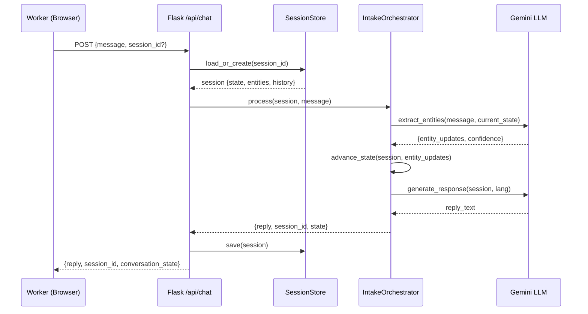
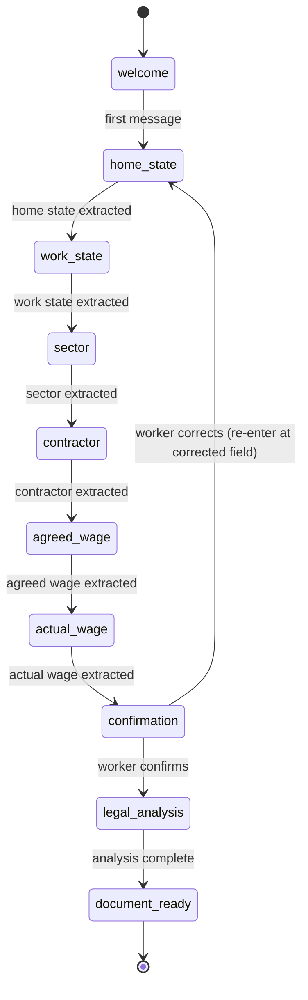

# Design Document: NyaySetu Chatbot

## Overview

NyaySetu AI is a legal-assistance chatbot for India's inter-state migrant workers. It guides workers through a structured intake flow, determines the correct legal jurisdiction deterministically, calculates wage arrears arithmetically, generates formal complaint documents (ISMWA Section 16, Labour Court petition, RTI), and tracks cases through escalation — all in the worker's native language via voice or text.

The system is built on an existing Flask + React/Vite stack. The backend already exposes `/api/chat` (Gemini LLM via `google-generativeai`) and `/api/voice` (Gemini STT). This design extends that foundation across five phases:

1. Server-side session management and structured intake flow
2. Jurisdiction engine and enhanced legal reasoning
3. OCR evidence pipeline and document generation
4. Multilingual depth and voice processing
5. Case tracking dashboard and escalation triggers

### Design Principles

- **Determinism for correctness-critical paths**: Jurisdiction routing and arrears calculation are pure arithmetic/rule-based — never LLM-inferred.
- **LLM for language, not logic**: The language model handles natural language understanding, entity extraction, and response generation only.
- **Minimal new dependencies**: Extend the existing Flask/Gemini/React stack rather than introducing new infrastructure.
- **Worker safety**: Home address excluded from PDFs by default; session data keyed by opaque IDs.

---

## Architecture

### High-Level Component Diagram

```mermaid
graph TD
    subgraph Frontend [React/Vite Frontend]
        UI[VoiceInput / ChatPage]
        Dashboard[DashboardPage]
        ImageUpload[ImageUpload Component]
    end

    subgraph Backend [Flask Backend]
        ChatRoute[/api/chat]
        VoiceRoute[/api/voice]
        CasesRoute[/api/cases]
        ImageRoute[/api/ocr]

        SessionStore[SessionStore\nin-memory / file-backed]
        IntakeOrchestrator[IntakeOrchestrator]
        EntityExtractor[EntityExtractor\nGemini LLM]
        LangDetector[LanguageDetector\nGemini LLM]
        JurisdictionEngine[JurisdictionEngine\nrule-based]
        ArrearsCalculator[ArrearsCalculator\npure arithmetic]
        OCRPipeline[OCRPipeline\nGemini Vision]
        DocumentGenerator[DocumentGenerator\nreportlab]
        CaseTracker[CaseTracker]
        EscalationScheduler[EscalationScheduler\nbackground thread]
    end

    subgraph Storage [File Storage]
        SessionFiles[sessions/*.json]
        CaseFiles[cases/*.json]
        PDFStore[pdfs/*.pdf]
    end

    UI -->|POST /api/chat| ChatRoute
    UI -->|POST /api/voice| VoiceRoute
    ImageUpload -->|POST /api/ocr| ImageRoute
    Dashboard -->|GET /api/cases| CasesRoute

    ChatRoute --> SessionStore
    ChatRoute --> IntakeOrchestrator
    IntakeOrchestrator --> EntityExtractor
    IntakeOrchestrator --> LangDetector
    IntakeOrchestrator --> JurisdictionEngine
    IntakeOrchestrator --> ArrearsCalculator
    IntakeOrchestrator --> DocumentGenerator
    IntakeOrchestrator --> CaseTracker

    ImageRoute --> OCRPipeline
    OCRPipeline --> EntityExtractor

    SessionStore --> SessionFiles
    CaseTracker --> CaseFiles
    DocumentGenerator --> PDFStore

    EscalationScheduler --> CaseTracker
    EscalationScheduler --> DocumentGenerator
```

### Request Flow: Chat Message



---

## Components and Interfaces

### 1. SessionStore

Manages server-side session lifecycle. For the hackathon scope, sessions are stored as JSON files under `backend/sessions/`. A production deployment would swap this for Redis or DynamoDB with no interface change.

```python
class SessionStore:
    def load_or_create(self, session_id: str | None) -> Session
    def save(self, session: Session) -> None
    def expire_old_sessions(self) -> None  # called by background thread
```

**Session TTL**: 24 hours from last message. Expired sessions return a new session on next access.

### 2. IntakeOrchestrator

The central coordinator. Receives a session and a user message, advances the intake state machine, calls sub-components as needed, and returns the reply text.

```python
class IntakeOrchestrator:
    def process(self, session: Session, message: str) -> OrchestratorResult
```

State machine transitions:



### 3. EntityExtractor

Calls Gemini to extract structured entities from free-form worker input. Returns typed values with confidence scores.

```python
@dataclass
class ExtractedEntities:
    home_state: str | None
    work_state: str | None
    sector: str | None
    contractor_name: str | None
    agreed_wage: int | None      # rupees per month
    actual_wage: int | None      # rupees per month
    duration_months: int | None
    confidence: dict[str, float] # per-field confidence 0.0–1.0

class EntityExtractor:
    def extract(self, message: str, current_state: ConversationState) -> ExtractedEntities
    def normalise_state(self, raw: str) -> str   # "UP" -> "Uttar Pradesh"
    def normalise_sector(self, raw: str) -> str  # "building kaam" -> "construction"
    def normalise_wage(self, raw: str) -> int    # "teen hazaar" -> 3000
```

Confidence threshold: values below 0.7 are flagged for worker confirmation before being stored.

### 4. LanguageDetector

Identifies the BCP-47 language code of incoming text. Uses a lightweight Gemini prompt; falls back to `hi` on failure.

```python
class LanguageDetector:
    SUPPORTED = {"hi", "bho", "mai", "or", "bn", "en"}
    def detect(self, text: str) -> str  # returns BCP-47 code
```

### 5. JurisdictionEngine

Pure rule-based lookup. No LLM involvement. Data is a static Python dict keyed by `(work_state, sector)` with a fallback to `(work_state, "general")`.

```python
@dataclass
class JurisdictionResult:
    authority_name: str
    office_address: str
    officer_designation: str
    ismwa_section: str          # e.g. "Section 16"
    complaint_form_id: str
    bocw_applicable: bool       # True when sector == "construction"

class JurisdictionEngine:
    def resolve(self, work_state: str, sector: str) -> JurisdictionResult
```

Coverage: all 28 states + 8 union territories. Data sourced from Ministry of Labour & Employment directory.

### 6. ArrearsCalculator

Pure arithmetic. No LLM. All monetary values are integers (paise-level precision not required for complaint purposes).

```python
@dataclass
class ArrearsBreakdown:
    wage_arrears: int           # (agreed - actual) × months
    displacement_allowance: int # 0.5 × agreed × months  (ISMWA §14)
    journey_allowance: int      # state schedule lookup
    total_claim: int

class ArrearsCalculator:
    def calculate(
        self,
        agreed_wage: int,
        actual_wage: int,
        duration_months: int,
        work_state: str,
        min_wage_floor: int | None = None,
    ) -> ArrearsBreakdown
```

If `actual_wage < min_wage_floor`, `agreed_wage` is replaced by `min_wage_floor` in the calculation and the adjustment is noted in the breakdown.

### 7. OCRPipeline

Sends uploaded images to Gemini Vision for structured extraction. Extends the existing `VoicePipeline` pattern.

```python
@dataclass
class OCRResult:
    amounts: list[int]
    dates: list[str]
    employer_name: str | None
    worker_name: str | None
    confidence: float

class OCRPipeline:
    def extract(self, image_bytes: bytes, mime_type: str) -> OCRResult
```

Confidence threshold: 0.70. Below threshold, values are surfaced to the worker for confirmation.

### 8. DocumentGenerator

Produces PDF documents using `reportlab`. Structural legal language is hardcoded in templates; the LLM only fills variable fields.

```python
class DocumentGenerator:
    def generate_complaint(self, session: Session, jurisdiction: JurisdictionResult, arrears: ArrearsBreakdown) -> bytes
    def generate_labour_court_petition(self, case: Case) -> bytes
    def generate_rti_application(self, case: Case) -> bytes
    def generate_oral_testimony_affidavit(self, session: Session) -> bytes
```

All documents include the mandatory legal disclaimer on page 1. Home address is excluded by default.

### 9. CaseTracker

Creates and updates case records. Persists to `backend/cases/*.json` for hackathon scope.

```python
@dataclass
class Case:
    case_id: str                # "NS-YYYY-NNN"
    worker_session_id: str
    employer_name: str
    wages_claimed: int
    status: CaseStatus          # intake | ready | filed | escalated | resolved
    filed_date: str | None      # ISO date
    next_action: str | None
    next_action_date: str | None
    resolution_date: str | None
    resolution_outcome: str | None

class CaseTracker:
    def create_case(self, session: Session, arrears: ArrearsBreakdown) -> Case
    def update_status(self, case_id: str, status: CaseStatus, **kwargs) -> Case
    def get_cases_for_session(self, session_id: str) -> list[Case]
    def get_all_cases(self) -> list[Case]
    def get_due_escalations(self) -> list[tuple[Case, str]]  # (case, trigger_type)
```

### 10. EscalationScheduler

Background thread (APScheduler or simple `threading.Timer`) that polls `CaseTracker.get_due_escalations()` every hour and triggers document generation + status updates.

```python
class EscalationScheduler:
    def start(self) -> None
    def _run_checks(self) -> None
```

Escalation triggers:
- Day 7 / Day 14: set `next_action` prompt in case record (surfaced to worker on next dashboard load)
- Day 30: generate Labour Court petition, update status to `escalated`
- Day 45: generate RTI application

---

## Data Models

### Session

```python
@dataclass
class Session:
    session_id: str                          # UUID4
    created_at: str                          # ISO datetime
    last_active: str                         # ISO datetime
    conversation_state: ConversationState    # enum
    entities: SessionEntities
    history: list[HistoryMessage]            # {role, content} pairs
    detected_language: str                   # BCP-47, default "hi"
    expired: bool

@dataclass
class SessionEntities:
    home_state: str | None = None
    work_state: str | None = None
    sector: str | None = None
    contractor_name: str | None = None
    agreed_wage: int | None = None
    actual_wage: int | None = None
    duration_months: int | None = None
    # OCR-populated fields
    ocr_amounts: list[int] = field(default_factory=list)
    ocr_dates: list[str] = field(default_factory=list)

class ConversationState(str, Enum):
    WELCOME = "welcome"
    HOME_STATE = "home_state"
    WORK_STATE = "work_state"
    SECTOR = "sector"
    CONTRACTOR = "contractor"
    AGREED_WAGE = "agreed_wage"
    ACTUAL_WAGE = "actual_wage"
    CONFIRMATION = "confirmation"
    LEGAL_ANALYSIS = "legal_analysis"
    DOCUMENT_READY = "document_ready"

@dataclass
class HistoryMessage:
    role: str    # "user" | "model"
    content: str
```

### Case

```python
class CaseStatus(str, Enum):
    INTAKE = "intake"
    READY = "ready"
    FILED = "filed"
    ESCALATED = "escalated"
    RESOLVED = "resolved"

@dataclass
class Case:
    case_id: str
    worker_session_id: str
    employer_name: str
    wages_claimed: int
    status: CaseStatus
    filed_date: str | None
    next_action: str | None
    next_action_date: str | None
    resolution_date: str | None
    resolution_outcome: str | None
```

### API Contracts

**POST /api/chat**
```json
// Request
{ "message": "string", "session_id": "string | null" }

// Response
{
  "reply": "string",
  "session_id": "string",
  "conversation_state": "string",
  "transcript_display": "string | null"
}
```

**POST /api/voice**
```json
// Request: multipart/form-data, field "audio" (webm/wav), optional "session_id"
// Response
{
  "text": "string",
  "detected_language": "string",
  "confidence": 0.0,
  "session_id": "string"
}
```

**POST /api/ocr**
```json
// Request: multipart/form-data, field "image" (jpeg/png/heic), "session_id"
// Response
{
  "amounts": [3000],
  "dates": ["2025-01-01"],
  "employer_name": "string | null",
  "worker_name": "string | null",
  "confidence": 0.85,
  "session_id": "string"
}
```

**GET /api/cases?session_id=xxx**
```json
// Response
{
  "cases": [
    {
      "case_id": "NS-2025-001",
      "employer_name": "string",
      "wages_claimed": 14000,
      "status": "filed",
      "filed_date": "2025-03-12",
      "next_action": "Day 7 follow-up pending",
      "next_action_date": "2025-03-19"
    }
  ]
}
```

**GET /api/cases/:case_id/document?type=complaint|petition|rti**
```
// Response: application/pdf (binary)
```

---

## Correctness Properties

*A property is a characteristic or behavior that should hold true across all valid executions of a system — essentially, a formal statement about what the system should do. Properties serve as the bridge between human-readable specifications and machine-verifiable correctness guarantees.*

### Property 1: Session creation on first message

*For any* first chat message sent without a session_id, the system should return a new unique session_id, and a subsequent request using that session_id should successfully load the session with the message in its history.

**Validates: Requirements 1.1, 1.2**

---

### Property 2: Session expiry on inactivity

*For any* session whose `last_active` timestamp is more than 24 hours in the past, a new request using that session_id should result in a new session being created and a new session_id being returned.

**Validates: Requirements 1.4, 1.5**

---

### Property 3: Intake state machine advances correctly

*For any* valid entity response provided in a given intake state, the `conversation_state` returned in the response should be the next expected state in the sequence (`welcome → home_state → work_state → sector → contractor → agreed_wage → actual_wage → confirmation`), and the response should contain exactly one question.

**Validates: Requirements 2.9, 3.1, 3.2**

---

### Property 4: City-to-state resolution

*For any* known Indian city name provided as a work state or home state, the system should resolve it to the correct official state name and confirm the resolved state with the worker.

**Validates: Requirements 2.8**

---

### Property 5: Jurisdiction engine coverage and completeness

*For any* valid Indian state or union territory (all 36) combined with any canonical sector, the JurisdictionEngine should return a result containing non-null values for: authority name, office address, officer designation, ISMWA section, and complaint form identifier. The result should be identical for repeated calls with the same inputs.

**Validates: Requirements 4.1, 4.2, 4.3**

---

### Property 6: Arrears calculation correctness and order-independence

*For any* valid combination of `agreed_wage`, `actual_wage`, `duration_months`, and `work_state`, the ArrearsCalculator should satisfy:
- `wage_arrears == (agreed_wage - actual_wage) × duration_months`
- `displacement_allowance == 0.5 × agreed_wage × duration_months`
- `total_claim == wage_arrears + displacement_allowance + journey_allowance`
- The result is identical regardless of the order in which entity fields are provided to the calculator.

**Validates: Requirements 8.1, 8.2, 8.3, 8.5, 18.3**

---

### Property 7: Entity normalization

*For any* colloquial or regional variant of a state name (e.g., "UP", "Bombay") or sector name (e.g., "building kaam", "kapda factory") or wage expression (e.g., "teen hazaar", "3k"), the EntityExtractor should return the canonical form (official state name, canonical sector, integer rupee value).

**Validates: Requirements 6.1, 6.2, 6.3**

---

### Property 8: OCR confidence threshold gating

*For any* OCR result with confidence ≥ 0.70, the extracted fields should be automatically stored in the session entities. For any OCR result with confidence < 0.70, the system should surface the value to the worker for confirmation rather than storing it directly.

**Validates: Requirements 7.3, 7.4**

---

### Property 9: Complaint document round-trip integrity

*For any* valid set of Required_Entities and a JurisdictionResult, generating a complaint PDF and then extracting the entity values from the PDF text should return values equivalent to the original inputs. Additionally, generating the complaint twice from the same inputs should produce identical documents.

**Validates: Requirements 9.3, 18.1, 18.2**

---

### Property 10: Mandatory legal disclaimer presence

*For any* generated document (complaint, petition, RTI, affidavit), the document text should contain the mandatory legal disclaimer string.

**Validates: Requirements 9.8, 17.1, 17.2**

---

### Property 11: Language response matching

*For any* incoming message in a supported language (hi, bho, mai, or, bn, en), the chatbot's response language should match the detected language of the most recent message. When the worker switches language mid-conversation, the response language should switch from that turn onward.

**Validates: Requirements 5.3, 12.1, 12.5**

---

### Property 12: Case record completeness on complaint generation

*For any* session that reaches `document_ready` state and generates a complaint, the CaseTracker should create a case record containing non-null values for all required fields: `case_id`, `worker_session_id`, `employer_name`, `wages_claimed`, `status`, `filed_date`, `next_action`, `next_action_date`.

**Validates: Requirements 14.1**

---

### Property 13: Escalation scheduling correctness

*For any* case that transitions to `filed` status on a given `filed_date`, the scheduled follow-up dates should be exactly `filed_date + 7`, `filed_date + 14`, `filed_date + 30`, and `filed_date + 45` days respectively.

**Validates: Requirements 15.1**

---

## Error Handling

### Session Errors

| Condition | Handling |
|---|---|
| Unknown or expired `session_id` | Create new session, return new `session_id` with HTTP 200 |
| Missing `session_id` on first message | Create new session normally |
| Session file corrupted | Log error, create new session, return new `session_id` |

### LLM / API Errors

| Condition | Handling |
|---|---|
| Gemini API timeout or 5xx | Retry up to 3 times with exponential backoff (1s, 2s, 4s); return user-facing error message on exhaustion |
| Gemini returns malformed JSON for entity extraction | Fall back to regex-based extraction; flag low confidence |
| Language detection fails | Default to `hi` (Hindi) |

### Voice / OCR Errors

| Condition | Handling |
|---|---|
| Empty transcript or confidence < 0.5 | Return chatbot message asking worker to repeat |
| Audio conversion fails (pydub) | Return audio as-is to Gemini; log warning |
| Image too blurry (OCR confidence < 0.70) | Ask worker to retake photo with lighting guidance |
| No evidence available | Offer oral testimony affidavit template |

### Document Generation Errors

| Condition | Handling |
|---|---|
| `reportlab` PDF generation fails | Return HTTP 500 with user-facing message; log full traceback |
| Missing required entity at document generation time | Return HTTP 400 listing missing fields; do not generate partial document |
| PDF file write fails | Return HTTP 500; do not update case status to `document_ready` |

### Jurisdiction Engine Errors

| Condition | Handling |
|---|---|
| Unknown work state | Ask worker to confirm state name directly |
| State known but no sector-specific entry | Fall back to `(work_state, "general")` entry |
| No entry found at all | Return HTTP 500; log as data gap requiring jurisdiction data update |

### Arrears Calculator Errors

| Condition | Handling |
|---|---|
| `agreed_wage < actual_wage` (worker overpaid) | Return zero wage arrears; note the anomaly to the worker |
| `duration_months == 0` | Return zero for all components; ask worker to confirm duration |
| Minimum wage floor not found for work state | Proceed without floor adjustment; log missing data |

---

## Testing Strategy

### Dual Testing Approach

Both unit tests and property-based tests are required. They are complementary:
- **Unit tests** verify specific examples, integration points, and error conditions.
- **Property tests** verify universal correctness across randomized inputs.

### Property-Based Testing

**Library**: `hypothesis` (Python) for backend; `fast-check` (npm) for frontend.

Each property test must run a minimum of **100 iterations**. Each test must be tagged with a comment referencing the design property it validates:

```
# Feature: nyaysetu-chatbot, Property N: <property_text>
```

**Property test mapping:**

| Design Property | Test Target | Pattern |
|---|---|---|
| Property 1: Session creation | `SessionStore.load_or_create` | Round-trip |
| Property 2: Session expiry | `SessionStore.load_or_create` with aged timestamp | Error condition |
| Property 3: State machine advances | `IntakeOrchestrator.process` | Invariant |
| Property 4: City-to-state resolution | `EntityExtractor.normalise_state` | Model-based |
| Property 5: Jurisdiction coverage | `JurisdictionEngine.resolve` | Invariant + Idempotence |
| Property 6: Arrears calculation | `ArrearsCalculator.calculate` | Invariant + Commutativity |
| Property 7: Entity normalization | `EntityExtractor.normalise_*` | Round-trip |
| Property 8: OCR confidence gating | `OCRPipeline` + session update logic | Metamorphic |
| Property 9: Document round-trip | `DocumentGenerator.generate_complaint` | Round-trip |
| Property 10: Disclaimer presence | All `DocumentGenerator` methods | Invariant |
| Property 11: Language matching | `LanguageDetector` + `IntakeOrchestrator` | Invariant |
| Property 12: Case record completeness | `CaseTracker.create_case` | Invariant |
| Property 13: Escalation scheduling | `CaseTracker.get_due_escalations` | Invariant |

**Example property test (ArrearsCalculator):**

```python
from hypothesis import given, settings
import hypothesis.strategies as st
from services.arrears_calculator import ArrearsCalculator

calc = ArrearsCalculator()

# Feature: nyaysetu-chatbot, Property 6: Arrears calculation correctness and order-independence
@given(
    agreed=st.integers(min_value=1000, max_value=100000),
    actual=st.integers(min_value=0, max_value=100000),
    months=st.integers(min_value=1, max_value=36),
    state=st.sampled_from(VALID_STATES),
)
@settings(max_examples=100)
def test_arrears_formula(agreed, actual, months, state):
    result = calc.calculate(agreed, actual, months, state)
    assert result.wage_arrears == max(0, (agreed - actual) * months)
    assert result.displacement_allowance == int(0.5 * agreed * months)
    assert result.total_claim == result.wage_arrears + result.displacement_allowance + result.journey_allowance
```

**Example property test (JurisdictionEngine):**

```python
from hypothesis import given, settings
import hypothesis.strategies as st
from services.jurisdiction_engine import JurisdictionEngine, ALL_STATES

engine = JurisdictionEngine()

# Feature: nyaysetu-chatbot, Property 5: Jurisdiction engine coverage and completeness
@given(
    state=st.sampled_from(ALL_STATES),
    sector=st.sampled_from(["construction", "garments", "domestic", "general"]),
)
@settings(max_examples=100)
def test_jurisdiction_coverage(state, sector):
    result = engine.resolve(state, sector)
    assert result.authority_name
    assert result.office_address
    assert result.officer_designation
    assert result.ismwa_section
    assert result.complaint_form_id
    # Idempotence
    assert engine.resolve(state, sector) == result
```

### Unit Testing

Unit tests focus on:
- Specific intake flow examples (welcome message, confirmation summary format)
- Integration between `IntakeOrchestrator` and sub-components
- Error conditions (empty transcript, missing entities at document generation)
- API endpoint contract validation (correct HTTP status codes, response shape)
- Dashboard rendering with live case data vs. empty state

**Test file structure:**
```
backend/tests/
  test_session_store.py
  test_intake_orchestrator.py
  test_entity_extractor.py
  test_jurisdiction_engine.py
  test_arrears_calculator.py
  test_ocr_pipeline.py
  test_document_generator.py
  test_case_tracker.py
  test_escalation_scheduler.py
  test_api_chat.py
  test_api_voice.py
  test_api_cases.py
  properties/
    test_prop_session.py
    test_prop_jurisdiction.py
    test_prop_arrears.py
    test_prop_document.py
    test_prop_language.py
    test_prop_state_machine.py
```

**Recommended test runner:** `pytest` with `pytest-hypothesis` plugin.

```bash
# Run all tests (single execution, no watch mode)
pytest backend/tests/ -v

# Run only property tests
pytest backend/tests/properties/ -v --hypothesis-seed=0
```
